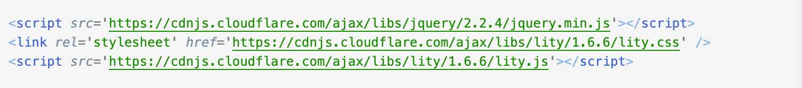
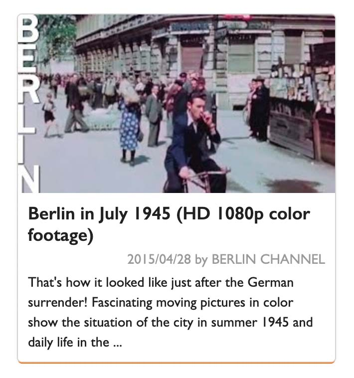
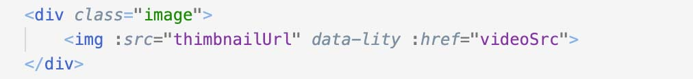

# video-browser

### Link to the app: [https://stackblitz.com/edit/naomix-youtube-app](https://stackblitz.com/edit/naomix-youtube-app)

## About The Project

Einfach erstellte ein Youtube Video-Browsing App, mit JavaScript, Vue.js und YouTube Data API. 

## Technologies Used 

* HTML5
* CSS3
* JavaScript
* Vue.js / Vue CLI
* Node.js / npm
* [YouTube Data API](https://developers.google.com/youtube/v3)
* axios
* [lity.js](https://sorgalla.com/lity/) (requires jQuery)
* [Semantic UI](https://semantic-ui.com/)

## App Usage

Tippe deine Suchbegriffe und drücke den "Search" Button. Dann kannst du die Suchergebnisse der Youtube-Videos als eine Card-Liste sehen. Wenn du ein Bild einer Karte klickst, kannst du das Video in einer Modal-Window schauen.

## Features

Video-Suchergebnisse werden als eine Card-List bekannt. In einer Seite gibt es maximal 12 Karten. 
Jede Card hat ein Thimbnail-Image vom Youtube-Video. Mit dem Klick des Bildes wird eine Modal-Window geöffnet und kann man das Youtube-Video sofort schauen. Dafür benutze ich das Plug-in, "lity.js".

### Implementation

#### lity.js

Lity ist ein leichtes Lightbox-Plug-in. Die Verwendung vom Plug-In "lity.js" ist sehr einfach.  
Im header vom HTML füge litys JavaScript und CSS Files und jQuery-JS ein.

###### index.html
 

###### Ein Card-Beispiel
 

Im diesem APP, wenn man das Thimbnail-Image klickt, wird das Video-URL ("videoSrc" has das Link) im litys Modal-Window geöffnet. Dafür braucht man einfach im img-Tag (Video-Thimbnail, Oberteil der Card) das Attribut "data-lity" hinzuzufügen.

###### VideoListItem.vue
 

## Roadmap

See the [issues](https://github.com/nao-mix/youtube-browse/issues) for a list of proposed features.

## Contact

naomix - [AUF DER REISE](https://aufderreise.com/) - info@aufderreise.com

